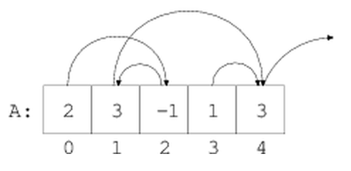
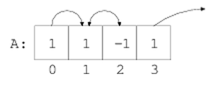

# Dokumentacja

Czyli jak efektywnie korzystać z dokumentacji na przykładzie biblioteki standardowej
i *intertoolsów*. Na specjalne życznie uczestników, pojawiają się też *generatory*.

## Zadania

### Custom filter
Mając listę A, zaimplementuj funkcję, która zwraca tylko elementy spełniające dane kryterium,
na przykład będące liczbami parzystymi.

### Week-day generator
Napisz funkcję, która zwraca kolejne dni tygodnia w zapętleniu.

### Power of two
Napisz funkcję, która zwraca kolejne potęgi dwójki.

## Zadanie domowe

### Enumerate

Sprawdź co robi `zip`, `izip` i `count`.
Napisz przy ich pomocy funkcję `enumerate`.

### List jump

A non-empty zero-indexed array A consisting of N integers is given. Each elements of the array can be treated as a relative pointer to another element in the array: if A[K]=M than element A[K] points to the element a[K+M].

The array defines a sequence of jumps of a pawn as follows:
* initially, a pawn is located at element A[0];
* on each jump a pawn moved from its current element to the destination element pointed by the current element; i.e. if the pawn stands on element A[K] then it jumps to an element to pointed by A[K];
the pawn may jump forever of may jump out of the array.

For example, consider the following array A:
A[0]=2        A[1]=3        A[2]=-1    A[3]=1        A[4]=3

This array defines the following sequence jumps of the pawn:
initially, the pawn is located at element A[0];
* on the first jump, the pawn moves from A[0] to A[2] because 0+ A[0]=2;
* on the second jump, the pawn moves from A[2] to A[1] because 2 + A[2]=1;
* on the third jump, the pawn moves from A[1] to A[4] because 1+A[1]=4;
* on the fourth jump, the pawn moves out of the array.

Write a function:
    *def solution(A)*
that, given a non-empty zero-indexed array A consisting of N integers, returns the number of jumps after which the pawn will be out of array. The function should return -1 if the pawn will never jump out of the array.

For example, for the array A given above, the function should return 4, as explained above. Given array A such that:
A[0]=1        A[1]=1         A[2]=-1     A[3]=1

that function should return -1.